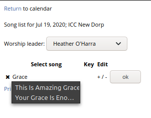

## Song selection process

The song selection process first requires that a singer be selected. This causes a REST call to be made in order to obtain not only the songs, which will be common for all singers, but the keys specific to that singer, which will vary:

The columns in the table are:

1. "x": deletes the row
1. Song: auto-fill drop-down
1. Key: the key for the song for that singer; can be overridden
1. +/-: moves row up or down in the song sequence
1. ok: accepts row and creates a new, empty row if this is the last row, or just stops editing if it is some other arbitrary row

---
## SongRow.js

The SongRow class should only be invoked when a new row is required. Editing a row should not create a new row in the table.

Rather than use a GUID, we can simply keep an incremental counter representing each row. The counter DOES NOT imply order, simply identification. Considering that rows can be moved up and down, the identifier will get out of sync with the sequence and therefore should be used solely as a unique identifier.

A row should be self-aware and not keep track of any externalities. The only thing a row knows outside of itself is the parent, which is the table.

---
## SongTable.js

Creates the table, creates the only actualy edit row, and puts the row into edit mode.

Creating the table is rather self-explanatory. However, the idea of a single "edit row" may not initially make sense. Assume that a table has 3 rows. Should we create an editable first row, make it static once editing is done, and then create a second editable row to continue data entry? In reality, the editable fields can be moved from row to row, and the fields can be replaced by static text once editing is done. SongTable.js creates the editable row (makes more sense to move this to SongRow).